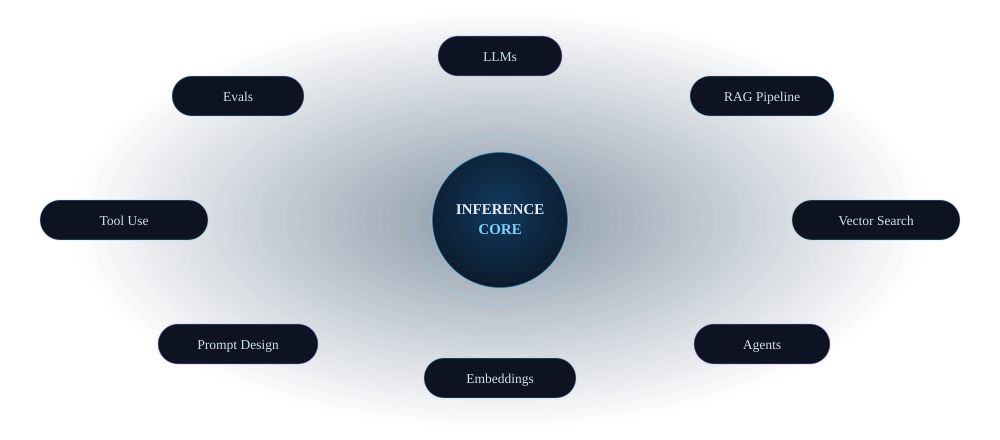

<!--
  ════════════════════════════════════════════════════════════════════
   Shivam Kumar Chaubey — GitHub Profile README
   Palette: deep navy #0D1320 · ice blue #7DD3FC · violet #A78BFA · slate #9FB0C7
   Decorative art lives in ./assets/svg  ·  project shots in ./assets/img
  ════════════════════════════════════════════════════════════════════
-->

<!-- ============================================================= -->
<!--  HERO                                                         -->
<!-- ============================================================= -->

<div align="center">



<br/><br/>

<a href="#-selected-work"></a>
&nbsp;
<a href="#-ai-as-an-engineering-discipline"></a>
&nbsp;
<a href="#-lets-build-something-that-has-to-work"></a>

<br/>

<sub>
<a href="#systems-before-syntax">Philosophy</a> &nbsp;·&nbsp;
<a href="#-what-i-build">Expertise</a> &nbsp;·&nbsp;
<a href="#-selected-work">Projects</a> &nbsp;·&nbsp;
<a href="#-ai-as-an-engineering-discipline">AI Systems</a> &nbsp;·&nbsp;
<a href="#-the-toolkit">Stack</a> &nbsp;·&nbsp;
<a href="#-where-my-attention-is-now">Focus</a> &nbsp;·&nbsp;
<a href="#-lets-build-something-that-has-to-work">Connect</a>
</sub>

</div>


<!-- ============================================================= -->
<!--  PHILOSOPHY                                                    -->
<!-- ============================================================= -->

<div align="center">

### Systems Before Syntax

</div>

> Software is not a stack of libraries — it is a set of decisions that have to keep working under pressure.
>
> I build backend systems that stay predictable as they grow, and I treat artificial intelligence as an engineering discipline: retrieval, evaluation, and reliability — not a magic box. I care about the parts of a system most people never see: the API contract that doesn't break, the queue that absorbs a spike, the agent loop that stays traceable back to its sources.
>
> I think like a chess player — plan the structure, control the center, and only then commit to the move.

<br/>


<!-- ============================================================= -->
<!--  EXPERTISE                                                     -->
<!-- ============================================================= -->

<div align="center">

### ⬡ What I Build

_Four domains, one mindset — design the system, then write the code._

</div>

<br/>

<table width="100%">
<tr>
<td width="50%" valign="top">

#### ⬡ &nbsp;Backend Systems

Reliable services that hold their shape under load — clean REST contracts, normalized data models, async messaging, and deployments that don't surprise you.

`Django` · `DRF` · `PostgreSQL` · `Kafka` · `Redis`

</td>
<td width="50%" valign="top">

#### ◇ &nbsp;Applied AI

LLM features built as real systems: retrieval-augmented generation, agentic tool-use loops, and evaluation — grounded in data and traceable to sources.

`Claude` · `LangGraph` · `RAG` · `Qdrant` · `ChromaDB`

</td>
</tr>
<tr>
<td width="50%" valign="top">

#### ❖ &nbsp;Distributed & Infra

The machinery that keeps services independent and scalable — containerized workers, task queues, event streams, and reproducible deploys.

`Docker` · `Kubernetes` · `Celery` · `GitHub Actions`

</td>
<td width="50%" valign="top">

#### △ &nbsp;Engineering Foundations

The fundamentals that make the rest hold up — data structures, algorithms, and system-design thinking practiced deliberately, every day.

`DSA` · `System Design` · `Git` · `Linux`

</td>
</tr>
</table>


<!-- ============================================================= -->
<!--  SELECTED WORK                                                 -->
<!-- ============================================================= -->

<div align="center">

### ◆ Selected Work

_A few systems I've designed and shipped._

</div>

<br/>

<!-- DeepResearch — backend/AI flagship, architecture-led -->
<div align="center">

#### DeepResearch — Agentic AI Research Assistant

</div>

> Ask a question → an autonomous agent **plans** sub-questions, **searches** the web and your documents, **verifies** claims against sources, and streams back a **cited research report** — live, step by step.

Built as production engineering, not an API call: a Django/DRF API dispatches jobs onto **Kafka**, Python agent-workers run the plan→search→verify→cite loop against **Claude** with **Qdrant** for RAG, and **Redis** fans progress events back to the UI over SSE. Every service is containerized and scales independently on **Kubernetes**.

```
React (Vite) ─HTTP/SSE─► Django + DRF ─produce─► Kafka ─consume─► Agent Worker(s)
     ▲                        │   ▲              topics              │
     └─ live progress ◄ Redis ◄┴──────── events ──────────── Claude · Web Search
                                                              Qdrant (RAG store)
```

`Django` · `Kafka` · `Qdrant` · `Redis` · `Claude` · `Docker` · `Kubernetes`
&nbsp;&nbsp;[**Explore the repository →**](https://github.com/Shivamchaubey14/research-agent)

<br/>

<!-- PayZap — backend, architecture-led -->
<div align="center">

#### PayZap — Payment Gateway Backend

</div>

> A payments platform backed by the unglamorous pieces that actually matter: settlements, payouts, fraud checks, and webhooks that never drop a message.

A Django service split into focused domains — `payments`, `payouts`, `settlements`, `merchants`, `fraud`, and `webhooks` — with monitoring, load tests, and a production Docker Compose stack. The interesting work is correctness under failure: idempotent webhook delivery, settlement reconciliation, and fraud signals evaluated inline.

`Django` · `PostgreSQL` · `Redis` · `Docker` · `Fraud Detection` · `Webhooks`
&nbsp;&nbsp;[**Explore the repository →**](https://github.com/Shivamchaubey14/payzap)

<br/>

<!-- LexAI — has real screenshot -->
<table width="100%">
<tr>
<td width="48%" valign="middle">

#### LexAI — Legal Contract Intelligence

**Counsel-grade contract review in under 30 seconds.**

An autonomous agent that reads a contract end-to-end: it flags 12+ risky clause types, scores overall exposure, suggests redlines in a diff view, and answers questions with citations to the **exact clause and page**.

A **LangGraph** agent drives the loop — searching contract chunks and a legal-playbook knowledge base in **ChromaDB**, grounding every answer in real text. The full pipeline runs async on **Celery + Redis**.

`Django` · `LangGraph` · `ChromaDB` · `Claude Sonnet` · `Celery`

[**Explore the repository →**](https://github.com/Shivamchaubey14/legal-agent)

</td>
<td width="52%" valign="middle">
<a href="https://github.com/Shivamchaubey14/legal-agent">

</a>
</td>
</tr>
</table>

<br/>

<!-- AlgoScope — has real screenshot -->
<table width="100%">
<tr>
<td width="52%" valign="middle">
<a href="https://github.com/Shivamchaubey14/leetcode_visualizer">

</a>
</td>
<td width="48%" valign="middle">

#### AlgoScope — Algorithm Visualizer

**Understand algorithms by watching them run.**

Step through a LeetCode solution **line by line** — every variable mutation, array shift, and call-stack frame rendered in real time via a custom `sys.settrace()` execution engine, drawn as a color-coded SVG flow graph.

Each problem ships with an **AI-generated explanation** (English & Hindi) from LLaMA 3.1, cached permanently after first load — zero repeat API calls.

`Django` · `Python` · `sys.settrace` · `LLaMA 3.1` · `SVG`

[**Explore the repository →**](https://github.com/Shivamchaubey14/leetcode_visualizer)

</td>
</tr>
</table>

<br/>

<div align="center">
<details>
<summary><b>More from the workshop</b></summary>
<br/>

| Project                                                                                         | What it is                                                                                                  | Stack                                   |
| :---------------------------------------------------------------------------------------------- | :---------------------------------------------------------------------------------------------------------- | :-------------------------------------- |
| [**MilkKart**](https://github.com/Shivamchaubey14/milkkart-backend)                             | Dairy quick-commerce platform — async Django backend + React Native app, Blinkit-style hyper-local delivery | `Django` · `MySQL` · `Redis` · `Celery` |
| [**Video Renting Services**](https://github.com/Shivamchaubey14/Video-Renting-Backend-Services) | Backend services for a video-rental platform — catalog, rentals, billing                                    | `Django` · `DRF`                        |
| [**Issue Tracker**](https://github.com/Shivamchaubey14/issue-tracker)                           | Ticketing system to track and resolve common hostel issues                                                  | `Django`                                |
| [**Solutions**](https://github.com/Shivamchaubey14/Solutions)                                   | A growing library of LeetCode solutions & hints                                                             | `Python`                                |

</details>
</div>


<!-- ============================================================= -->
<!--  AI SYSTEMS                                                    -->
<!-- ============================================================= -->

<div align="center">

### ◇ AI as an Engineering Discipline

_Not a feature bolted on — a set of moving parts that have to be designed, measured, and trusted._

<br/>



<br/><br/>

</div>

A useful AI feature is a pipeline, not a prompt. Retrieval decides what the model sees; prompt structure decides how it reasons; evaluation decides whether you can ship it. I build these pieces to fit together — grounding language models in real data, keeping outputs traceable to their sources, and treating _"is this actually correct?"_ as a first-class requirement rather than an afterthought.


<!-- ============================================================= -->
<!--  STACK                                                         -->
<!-- ============================================================= -->

<div align="center">

### ❖ The Toolkit

_Chosen for what they let me build — grouped by where they live in a system._

<br/>

**Languages & Core**


**Backend & Data**


**AI & Frontend**


**Infrastructure & Tooling**


</div>


<!-- ============================================================= -->
<!--  CURRENT FOCUS                                                 -->
<!-- ============================================================= -->

<div align="center">

### △ Where My Attention Is Now

</div>

<table width="100%">
<tr>
<td width="33%" align="center"><br/><b>Agentic AI</b><br/><sub>RAG, tool use,<br/>evaluation loops</sub><br/><br/></td>
<td width="33%" align="center"><br/><b>Distributed Backends</b><br/><sub>Kafka, queues,<br/>scale &amp; reliability</sub><br/><br/></td>
<td width="33%" align="center"><br/><b>Cloud &amp; Containers</b><br/><sub>Docker, Kubernetes,<br/>reproducible deploys</sub><br/><br/></td>
</tr>
</table>

<br/>

<div align="center">

[](https://github.com/Shivamchaubey14?tab=repositories)
&nbsp;
[](https://github.com/Shivamchaubey14/Solutions)

</div>


<!-- ============================================================= -->
<!--  STATS                                                         -->
<!-- ============================================================= -->

<div align="center">

### ▲ The Work, Measured

<br/>


&nbsp;


<br/><br/>


<br/><br/>


</div>


<!-- ============================================================= -->
<!--  CONNECT                                                       -->
<!-- ============================================================= -->

<div align="center">

### ◈ Let's build something that has to work.

I'm most interested in conversations about backend architecture, applied AI, and the craft of making software that lasts. If you're working on something ambitious — or hiring for a team that is — I'd like to hear about it.

<br/>

[](https://github.com/Shivamchaubey14)
&nbsp;
[](mailto:shivamc36@gmail.com)
&nbsp;
[](mailto:shivamc36@gmail.com)

</div>

<!-- ============================================================= -->
<!--  FOOTER                                                        -->
<!-- ============================================================= -->


<div align="center">

<sub><i>"First, solve the problem. Then, write the code."</i></sub>

<br/>

<sub>Designed &amp; built by Shivam Kumar Chaubey · Uttar Pradesh, India</sub>

</div>
