<!--
  ╔══════════════════════════════════════════════════════════════════╗
  ║  SHIVAM KUMAR CHAUBEY · NEURAL-OS v5.0                            ║
  ║  A GitHub profile designed as a living artificial brain:          ║
  ║   · repositories  = memories                                      ║
  ║   · commits       = electrical impulses                           ║
  ║   · technologies  = neurons                                       ║
  ║   · projects      = cognitive functions                           ║
  ║  Palette · void #050505 · graphite #0D1117 · midnight #0A1128     ║
  ║           · cyan #22D3EE · blue #60A5FA · violet #A78BFA          ║
  ║  All animated artwork is hand-built SVG (SMIL + CSS) in           ║
  ║  ./assets/svg — no rasters, honors prefers-reduced-motion,       ║
  ║  auto-switches dark/light via <picture>.                          ║
  ╚══════════════════════════════════════════════════════════════════╝
-->

<a name="top"></a>

<div align="center">

<picture>
  <source media="(prefers-color-scheme: light)" srcset="./assets/svg/neural-hero-light.svg">
  
</picture>


<br/>

<!-- ─── floating glass-capsule navigation ─── -->
<a href="#stack"></a>&nbsp;<a href="#evolution"></a>&nbsp;<a href="#modules"></a>&nbsp;<a href="#command"></a>&nbsp;<a href="#telemetry"></a>&nbsp;<a href="#uplink"></a>

</div>


<!-- ═══════════════════════════════════════════════════════════════ -->
<!--  KERNEL · IDENTITY                                              -->
<!-- ═══════════════════════════════════════════════════════════════ -->

<a name="kernel"></a>

<div align="center">

### `◈ KERNEL` — The Central Intelligence

</div>

```text
┌─ NEURAL-OS v5.0 ─────────────────────────────────────────────────────────┐
│                                                                          │
│  identity      : Shivam Kumar Chaubey                                    │
│  designation   : Full-Stack Engineer → AI Engineer                       │
│  architecture  : systems before syntax                                   │
│  prime residue : the API contract that doesn't break, the queue that     │
│                  absorbs a spike, the agent loop that stays traceable    │
│                  back to its sources                                     │
│  operating law : software is not a stack of libraries — it is a set of   │
│                  decisions that have to keep working under pressure      │
│  strategy      : think like a chess player — plan the structure,         │
│                  control the center, then commit to the move             │
│                                                                          │
└──────────────────────────────── all subsystems nominal ─────────────────┘
```

> In this network, **repositories are memories**, **commits are electrical impulses**, **technologies are neurons**, and **projects are cognitive functions**. I treat AI as an engineering discipline — retrieval, evaluation, and reliability, not a magic box — and I build backend systems that stay predictable as they grow.


<!-- ═══════════════════════════════════════════════════════════════ -->
<!--  NEURAL STACK · TECHNOLOGY CORTEX                               -->
<!-- ═══════════════════════════════════════════════════════════════ -->

<a name="stack"></a>

<div align="center">

### `⌬ NEURAL STACK` — 32 Technology Neurons · 6 Cortices

_Every skill is a neuron. Every connection carries live impulses. The network never sleeps._

<br/>


<br/>

<details>
<summary><b>⌬ &nbsp;Expand neuron cluster — iconic view</b></summary>
<br/>

**Language Cortex**


**Logic Cortex — Backend**


**AI Cortex**


**Memory Cortex — Data**


**Interface Cortex — Frontend & Mobile**


**Infra Cortex**


</details>

</div>


<!-- ═══════════════════════════════════════════════════════════════ -->
<!--  EVOLUTION PATHWAY                                              -->
<!-- ═══════════════════════════════════════════════════════════════ -->

<a name="evolution"></a>

<div align="center">

### `◈ EVOLUTION PATHWAY` — The Network Rewires Itself

_Five checkpoints on one fiber-optic spine. The impulse only travels forward._

<br/>

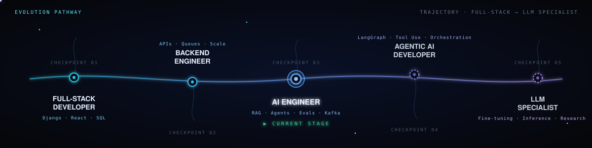

</div>


<!-- ═══════════════════════════════════════════════════════════════ -->
<!--  AI MODULES · COGNITIVE FUNCTIONS                               -->
<!-- ═══════════════════════════════════════════════════════════════ -->

<a name="modules"></a>

<div align="center">

### `⬡ AI MODULES` — Cognitive Functions of the Network

_Each project is a specialized module wired directly into the core — its own color, its own function, one design language._

</div>

<br/>

<!-- ── MODULE 01 · DEEPRESEARCH · cyan ── -->
<div align="center">


#### DeepResearch — Agentic AI Research Assistant

</div>

> Ask a question → an autonomous agent **plans** sub-questions, **searches** the web and your documents, **verifies** claims against sources, and streams back a **cited research report** — live, step by step.

Built as production engineering, not an API call: a Django/DRF API dispatches jobs onto **Kafka**, Python agent-workers run the plan→search→verify→cite loop against **Claude** with **Qdrant** for RAG, and **Redis** fans progress events back to the UI over SSE. Every service is containerized and scales independently on **Kubernetes**.

```text
React (Vite) ─HTTP/SSE─► Django + DRF ─produce─► Kafka ─consume─► Agent Worker(s)
     ▲                        │   ▲              topics              │
     └─ live progress ◄ Redis ◄┴──────── events ──────────── Claude · Web Search
                                                              Qdrant (RAG store)
```

`Django` · `Kafka` · `Qdrant` · `Redis` · `Claude` · `Docker` · `Kubernetes`
&nbsp;&nbsp;[**⌬ Open module →**](https://github.com/Shivamchaubey14/research-agent)

<br/>

<!-- ── MODULE 02 · LEXAI · violet ── -->
<table width="100%">
<tr>
<td width="48%" valign="middle">


#### LexAI — Legal Contract Intelligence

**Counsel-grade contract review in under 30 seconds.**

An autonomous agent that reads a contract end-to-end: it flags 12+ risky clause types, scores overall exposure, suggests redlines in a diff view, and answers questions with citations to the **exact clause and page**.

A **LangGraph** agent drives the loop — searching contract chunks and a legal-playbook knowledge base in **ChromaDB**, grounding every answer in real text. The full pipeline runs async on **Celery + Redis**.

`Django` · `LangGraph` · `ChromaDB` · `Claude Sonnet` · `Celery`

[**⌬ Open module →**](https://github.com/Shivamchaubey14/legal-agent)

</td>
<td width="52%" valign="middle">
<a href="https://github.com/Shivamchaubey14/legal-agent">

</a>
</td>
</tr>
</table>

<br/>

<!-- ── MODULE 03 · PAYZAP · blue ── -->
<div align="center">


#### PayZap — Payment Gateway Backend

</div>

> A payments platform backed by the unglamorous pieces that actually matter: settlements, payouts, fraud checks, and webhooks that never drop a message.

A Django service split into focused domains — `payments`, `payouts`, `settlements`, `merchants`, `fraud`, and `webhooks` — with monitoring, load tests, and a production Docker Compose stack. The interesting work is correctness under failure: idempotent webhook delivery, settlement reconciliation, and fraud signals evaluated inline.

`Django` · `PostgreSQL` · `Redis` · `Docker` · `Fraud Detection` · `Webhooks`
&nbsp;&nbsp;[**⌬ Open module →**](https://github.com/Shivamchaubey14/payzap)

<br/>

<!-- ── MODULE 04 · ALGOSCOPE · silver ── -->
<table width="100%">
<tr>
<td width="52%" valign="middle">
<a href="https://github.com/Shivamchaubey14/leetcode_visualizer">
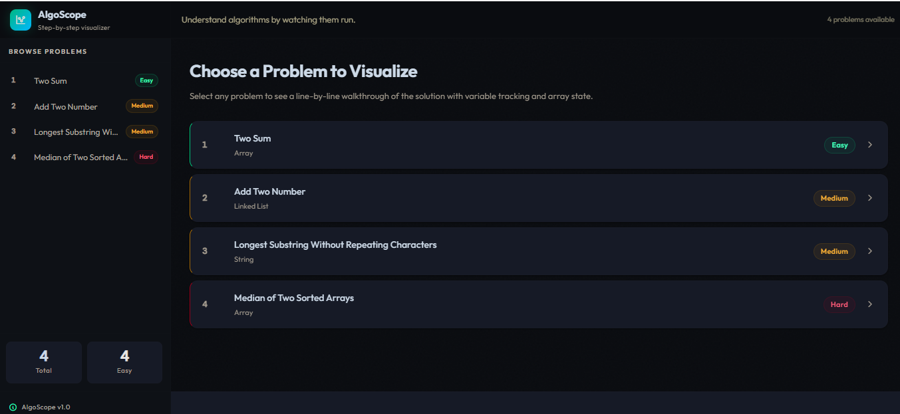
</a>
</td>
<td width="48%" valign="middle">


#### AlgoScope — Algorithm Visualizer

**Understand algorithms by watching them run.**

Step through a LeetCode solution **line by line** — every variable mutation, array shift, and call-stack frame rendered in real time via a custom `sys.settrace()` execution engine, drawn as a color-coded SVG flow graph.

Each problem ships with an **AI-generated explanation** (English & Hindi) from LLaMA 3.1, cached permanently after first load — zero repeat API calls.

`Django` · `Python` · `sys.settrace` · `LLaMA 3.1` · `SVG`

[**⌬ Open module →**](https://github.com/Shivamchaubey14/leetcode_visualizer)

</td>
</tr>
</table>

<br/>

<!-- ── orbital repository cards ── -->
<div align="center">

<sub>`ORBITAL RING` — modules in active rotation around the core</sub>

<br/><br/>

<a href="https://github.com/Shivamchaubey14/research-agent"></a>&nbsp;<a href="https://github.com/Shivamchaubey14/legal-agent"></a>

<a href="https://github.com/Shivamchaubey14/payzap"></a>&nbsp;<a href="https://github.com/Shivamchaubey14/leetcode_visualizer"></a>

<br/>

<details>
<summary><b>◇ &nbsp;Deep memory archive — earlier synapses</b></summary>
<br/>

| Memory                                                                                          | Cognitive function                                                                                           | Neurons involved                        |
| :---------------------------------------------------------------------------------------------- | :----------------------------------------------------------------------------------------------------------- | :--------------------------------------- |
| [**MilkKart**](https://github.com/Shivamchaubey14/milkkart-backend)                             | Dairy quick-commerce platform — async Django backend + React Native app, Blinkit-style hyper-local delivery  | `Django` · `MySQL` · `Redis` · `Celery` |
| [**Video Renting Services**](https://github.com/Shivamchaubey14/Video-Renting-Backend-Services) | Backend services for a video-rental platform — catalog, rentals, billing                                     | `Django` · `DRF`                        |
| [**Issue Tracker**](https://github.com/Shivamchaubey14/issue-tracker)                           | Ticketing system to track and resolve common hostel issues                                                   | `Django`                                |
| [**Solutions**](https://github.com/Shivamchaubey14/Solutions)                                   | A growing library of LeetCode solutions & hints — daily DSA impulses                                         | `Python`                                |

</details>
</div>


<!-- ═══════════════════════════════════════════════════════════════ -->
<!--  COMMAND CENTER                                                 -->
<!-- ═══════════════════════════════════════════════════════════════ -->

<a name="command"></a>

<div align="center">

### `◉ COMMAND CENTER` — Active Processes

_What the network is computing right now._

<br/>


<br/>

[](https://github.com/Shivamchaubey14?tab=repositories)
&nbsp;
[](https://github.com/Shivamchaubey14/Solutions)
&nbsp;
[](https://github.com/Shivamchaubey14)

</div>


<!-- ═══════════════════════════════════════════════════════════════ -->
<!--  TELEMETRY · NEURAL DASHBOARD                                   -->
<!-- ═══════════════════════════════════════════════════════════════ -->

<a name="telemetry"></a>

<div align="center">

### `▲ TELEMETRY` — Impulse Activity, Measured


<br/>

<!-- hand-built telemetry cards (numbers refreshed manually — GitHub GraphQL, see git history) -->
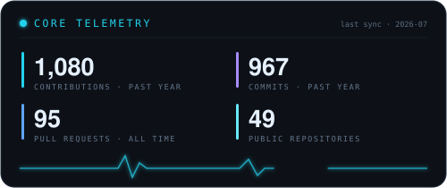&nbsp;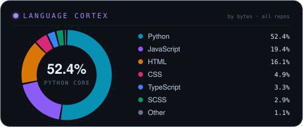

<br/><br/>


<br/><br/>

<sub>`CONTRIBUTION ENERGY GRID` — every commit lights up the surrounding neurons</sub>

<br/><br/>

<picture>
  <source media="(prefers-color-scheme: light)" srcset="https://raw.githubusercontent.com/Shivamchaubey14/Shivamchaubey14/output/neural-snake-light.svg">
  
</picture>

<br/><br/>


<br/><br/>

<details>
<summary><b>▲ &nbsp;Full diagnostic readout — isometric calendar, habits, achievements</b></summary>
<br/>

</details>

</div>


<!-- ═══════════════════════════════════════════════════════════════ -->
<!--  UPLINK · CONNECT                                               -->
<!-- ═══════════════════════════════════════════════════════════════ -->

<a name="uplink"></a>

<div align="center">

### `◇ UPLINK` — Open a Channel to the Core

I'm most interested in conversations about backend architecture, applied AI, and the craft of making software that lasts. If you're working on something ambitious — or hiring for a team that is — transmit.

<br/>

[](https://github.com/Shivamchaubey14)
&nbsp;
[](mailto:shivamchaubey1412@gmail.com)
&nbsp;
[](mailto:shivamchaubey1412@gmail.com)

<br/><br/>

<sub><i>"First, solve the problem. Then, write the code."</i></sub>

</div>


