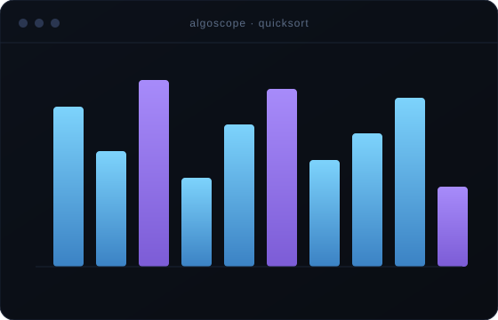
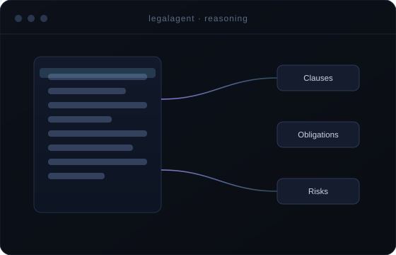

<!-- ============================================================= -->
<!--  HERO                                                         -->
<!-- ============================================================= -->

  

&nbsp;

&nbsp;

 

<a href="#philosophy">Philosophy</a> &nbsp;·&nbsp;
<a href="#expertise">Expertise</a> &nbsp;·&nbsp;
<a href="#projects">Projects</a> &nbsp;·&nbsp;
<a href="#ai">AI Systems</a> &nbsp;·&nbsp;
<a href="#stack">Stack</a> &nbsp;·&nbsp;
<a href="#focus">Focus</a> &nbsp;·&nbsp;
<a href="#connect">Connect</a>

<!-- ============================================================= -->
<!--  PHILOSOPHY                                                    -->
<!-- ============================================================= -->

### Systems Before Syntax

> Software is not a stack of libraries — it is a set of decisions that have to keep working under pressure.
>
> I build backend systems that stay predictable as they grow, and I treat artificial intelligence as an engineering discipline: data flows, evaluation, and reliability — not a magic box. I care about the parts of a system most people never see: the API contract that doesn't break, the query that stays fast at scale, the abstraction that a future engineer can actually reason about.
>
> I think like a chess player — plan the structure, control the center, and only then commit to the move.

 

<!-- ============================================================= -->
<!--  EXPERTISE                                                     -->
<!-- ============================================================= -->

### What I Build

*Four domains, one mindset — design the system, then write the code.*

 

<table width="100%">
<tr>
<td width="50%" valign="top">

#### ⬡ &nbsp;Backend Systems

Reliable services that hold their shape under load — clean REST contracts, normalized data models, caching where it counts, and deployments that don't surprise you.

`Django` · `REST` · `PostgreSQL` · `Docker`

</td>
<td width="50%" valign="top">

#### ◇ &nbsp;Artificial Intelligence

LLM-powered features treated as real systems: retrieval, prompt design, and reasoning pipelines built to be evaluated and refined — not just demoed once.

`LLMs` · `RAG` · `Prompt Engineering` · `Python`

</td>
</tr>
<tr>
<td width="50%" valign="top">

#### ❖ &nbsp;Frontend Experiences

Interfaces built around clarity — component systems, responsive layouts, and motion used to explain rather than decorate.

`React` · `JavaScript` · `HTML5` · `CSS3`

</td>
<td width="50%" valign="top">

#### △ &nbsp;Engineering Foundations

The fundamentals that make the rest hold up — data structures, algorithms, and system-design thinking practiced deliberately, every day.

`DSA` · `System Design` · `Git` · `Linux`

</td>
</tr>
</table>

<!-- ============================================================= -->
<!--  PROJECTS                                                      -->
<!-- ============================================================= -->

### Selected Work

*A few systems I've designed and shipped.*

 

<!-- Project 01 — image left, content right -->
<table width="100%">
<tr>
<td width="52%" valign="middle">

</td>
<td width="48%" valign="middle">

#### AlgoScope

**Turning abstract algorithms into something you can watch think.**

A step-by-step visualizer that animates how sorting, searching, and graph algorithms actually execute — built to make the invisible logic of DSA legible.

The engineering challenge is timing: rendering each comparison and swap as a discrete, reversible state so the animation maps exactly to the algorithm, not an approximation of it.

`Python` · `Django` · `JavaScript`

[**Explore the repository →**](https://github.com/Shivamchaubey14/leetcode_visualizer)

</td>
</tr>
</table>

 

<!-- Project 02 — content left, image right -->
<table width="100%">
<tr>
<td width="48%" valign="middle">

#### LegalAgent

**An AI reading layer for documents people dread reading.**

A query-driven assistant that breaks dense legal text into structured reasoning — clauses, obligations, and risks — using LLMs as an analysis engine rather than a chat toy.

The interesting work lives in the pipeline: grounding model output in the source document, shaping prompts for consistency, and keeping the reasoning traceable back to the text it came from.

`Python` · `LLMs` · `NLP`

[**Explore the repository →**](https://github.com/Shivamchaubey14/LegalAgent)

</td>
<td width="52%" valign="middle">

</td>
</tr>
</table>

 

<b>More from the workshop</b>

 

| Project | What it is | Stack |
|:--|:--|:--|
| [**Tindog**](https://github.com/Shivamchaubey14/Tindog) | A responsive "Tinder for dogs" landing page — layout and motion fundamentals | `Bootstrap` · `HTML` · `JS` |
| [**DrumMaster**](https://github.com/Shivamchaubey14/DrumMaster) | A browser drum machine wired entirely to keyboard + event handling | `Vanilla JS` |
| [**TodoApp**](https://github.com/Shivamchaubey14/TodoApp) | A React task manager focused on clean component state | `React` · `JS` |

<!-- ============================================================= -->
<!--  AI SYSTEMS                                                    -->
<!-- ============================================================= -->

### AI as an Engineering Discipline

*Not a feature bolted on — a set of moving parts that have to be designed, measured, and trusted.*

 

  

A useful AI feature is a pipeline, not a prompt. Retrieval decides what the model sees; prompt structure decides how it reasons; evaluation decides whether you can ship it. I build these pieces to fit together — grounding language models in real data, keeping outputs traceable, and treating "is this actually correct?" as a first-class requirement rather than an afterthought.

<!-- ============================================================= -->
<!--  STACK                                                         -->
<!-- ============================================================= -->

### The Toolkit

*Chosen for what they let me build — grouped by where they live in a system.*

 

**Languages & Core**

**Backend & Data**

**Frontend**

**Infrastructure & Tooling**

<!-- ============================================================= -->
<!--  CURRENT FOCUS                                                 -->
<!-- ============================================================= -->

### Where My Attention Is Now

<table width="100%">
<tr>
<td width="33%" align="center"> <b>LLM Systems</b> retrieval, evaluation, reasoning pipelines  </td>
<td width="33%" align="center"> <b>System Design</b> scale, caching, data modeling  </td>
<td width="33%" align="center"> <b>Cloud & Containers</b> Docker workflows, reproducible deploys  </td>
</tr>
</table>

 

&nbsp;

<!-- ============================================================= -->
<!--  STATS                                                         -->
<!-- ============================================================= -->

### The Work, Measured

 

&nbsp;

  

  

<!-- ============================================================= -->
<!--  CONNECT                                                       -->
<!-- ============================================================= -->

### Let's build something that has to work.

I'm most interested in conversations about backend architecture, applied AI, and the craft of making software that lasts. If you're working on something ambitious — or hiring for a team that is — I'd like to hear about it.

 

&nbsp;

&nbsp;

<!-- ============================================================= -->
<!--  FOOTER                                                        -->
<!-- ============================================================= -->

<i>"First, solve the problem. Then, write the code."</i>

 

Designed & built by Shivam Kumar Chaubey · Uttar Pradesh, India

